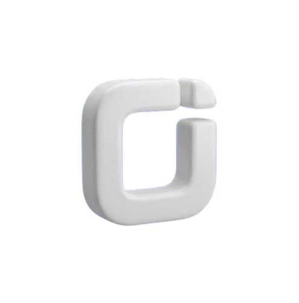

    

    

 
 

    <b style="font-weight: normal">Stuff I like:</b>

<table align="center" style="border: none!important">
  <tr>
    <td></td>
    <td>
    <td></td>
    <td></td>
    <td></td>
    <td>
    <td></td>
    <td></td>
    <td></td>
    <td></td>
    <td></td>
    <td></td>
    <td></td>
    <td></td>
    <td></td>
    <td></td>
    <td></td>
    <td></td>
  </tr>
</table>

     
    

